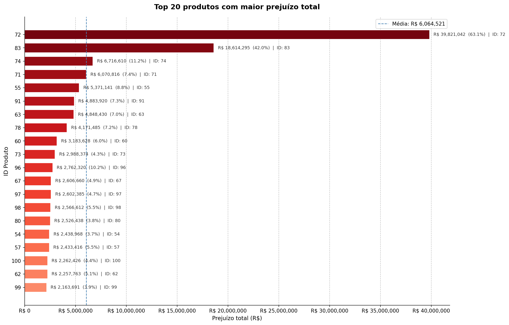

<!-- Imagem do repositório (caminho relativo) -->

<!-- Com tamanho controlado -->

<!-- Centralizado -->

  

# Relatório Analítico — LH Nautical

## Sumário Executivo

## 1. Qualidade dos Dados

## 2. Análise de Prejuízo

## 3. Clientes Fiéis

## 4. Sazonalidade de Vendas

## 5. Previsão de Demanda

## 6. Sistema de Recomendação

## Conclusões e Recomendações
