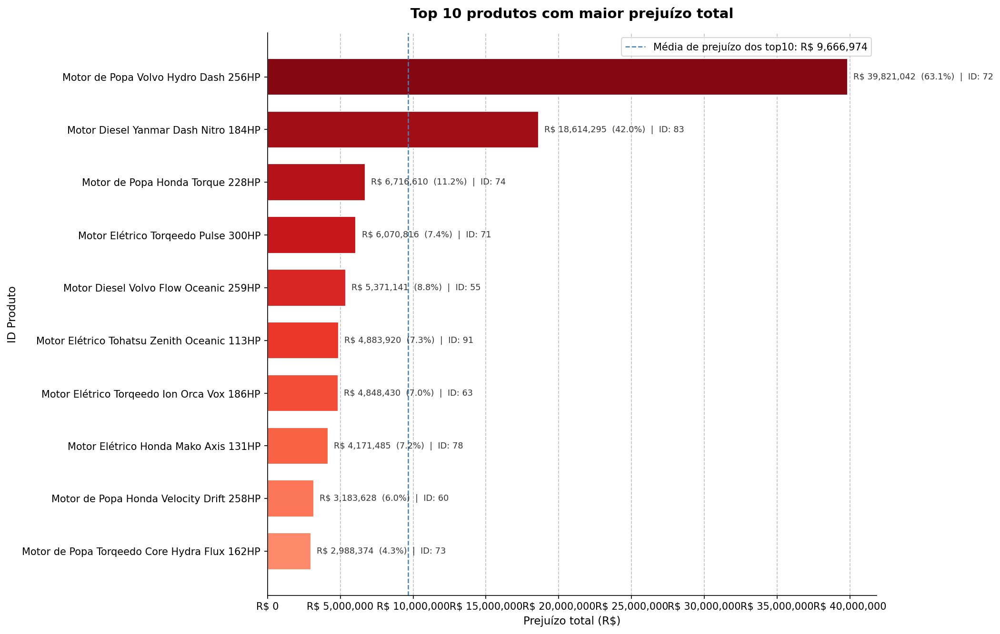
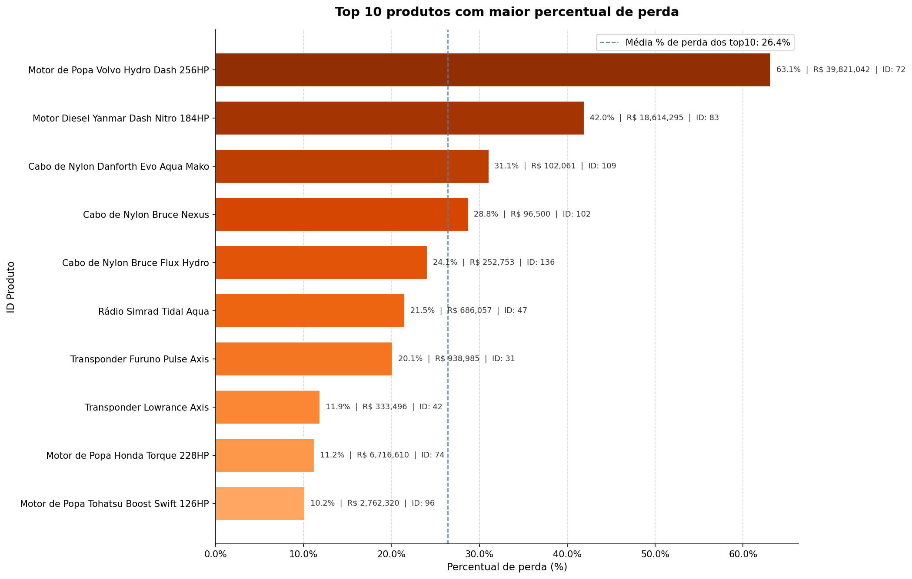
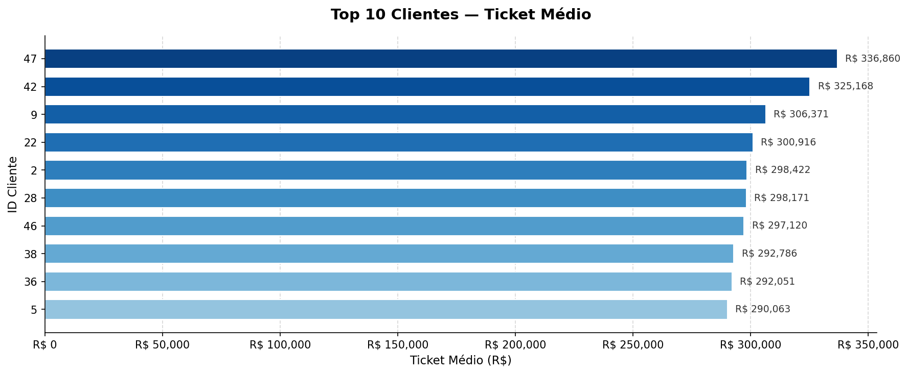
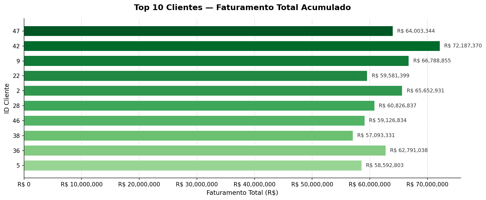
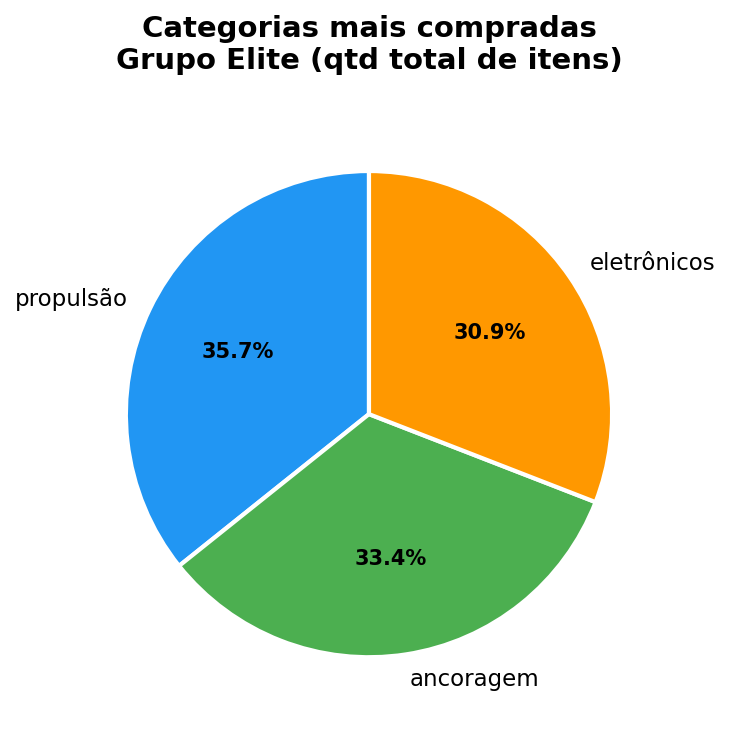
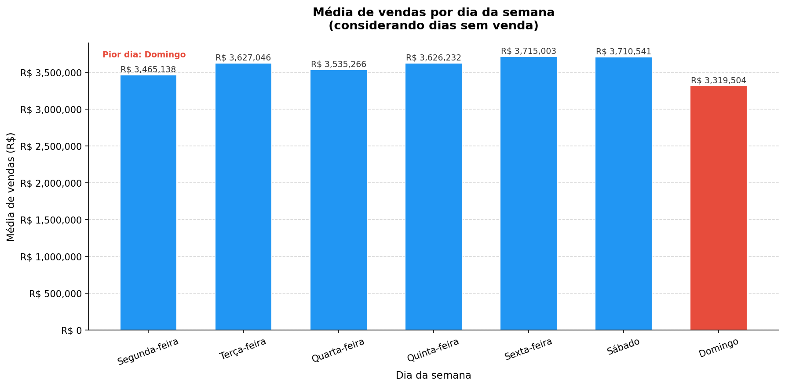
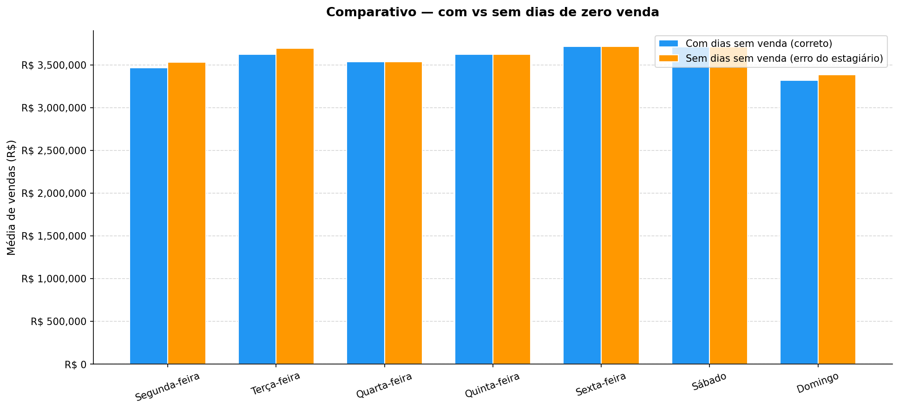
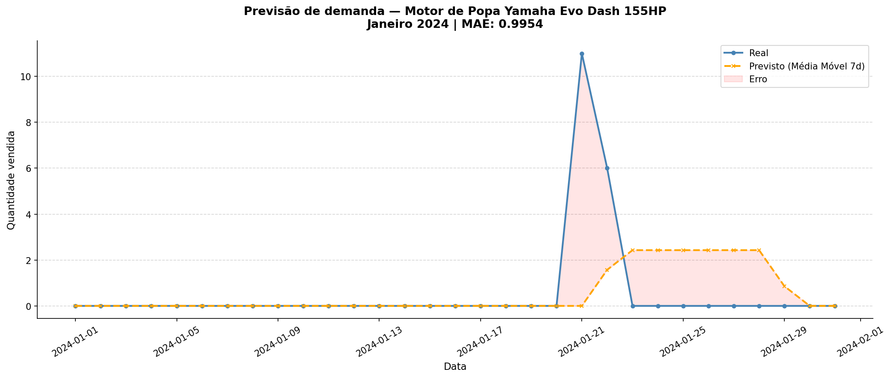

# Relatório — LH Nautical

> Desafio Lighthouse — Indicium Data & AI

---

## 📌 Sumário

1. [Contexto e Diagnóstico Geral](#1-contexto-e-diagnóstico-geral)
2. [Qualidade dos Dados — O Primeiro Problema](#2-qualidade-dos-dados--o-primeiro-problema)
3. [A Caixa Preta Financeira — Análise de Prejuízo](#3-a-caixa-preta-financeira--análise-de-prejuízo)
4. [Quem Sustenta o Negócio — Análise de Clientes Elite](#4-quem-sustenta-o-negócio--análise-de-clientes-elite)
5. [Quando a Loja Performa — Dimensão de Calendário](#5-quando-a-loja-performa--dimensão-de-calendário)
6. [Quanto Vamos Vender — Previsão de Demanda](#6-quanto-vamos-vender--previsão-de-demanda)
7. [O Que Recomendar — Sistema de Recomendação](#7-o-que-recomendar--sistema-de-recomendação)
8. [Conclusões e Plano de Ação](#8-conclusões-e-plano-de-ação)

---

## 1. Contexto e Diagnóstico Geral

A LH Nautical opera em modelo híbrido, loja física em Florianópolis e e-commerce nacional, e atravessa um momento crítico: crescimento acelerado sem estrutura de dados capaz de suportar decisões estratégicas. O controle de estoque ainda é feito em planilhas manuais, o sistema de vendas não conversa com o financeiro, e a diretoria opera no feeling.

Este relatório transforma **9.895 transações de vendas** realizadas entre janeiro de 2023 e dezembro de 2024 em inteligência acionável, identificando onde a empresa está perdendo dinheiro, quem são seus clientes mais valiosos e como antecipar a demanda.

| Dimensão                         | Valor                                    |
| -------------------------------- | ---------------------------------------- |
| Período analisado                | 01/01/2023 a 31/12/2024                  |
| Total de transações              | 9.895                                    |
| Receita total bruta              | R$ 2.610.279.510,70                      |
| Produtos catalogados             | 150                                      |
| Clientes ativos                  | 49                                       |
| **Prejuízo total identificado**  | **R$ 182.226.478,73**                    |
| **Prejuízo sobre receita total** | **6,98% da receita consumida por custo** |

> **Para o Sr. Almir:** em linguagem direta — encontramos R$ 182 milhões em prejuízo acumulado no período, sobre uma receita bruta de R$ 2,6 bilhões. Esse número não estava visível em nenhuma planilha porque ninguém havia cruzado o custo de importação em dólar com o valor de venda em real. É exatamente o tipo de problema que dados organizados revelam.

---

## 2. Qualidade dos Dados — O Primeiro Problema

Antes de qualquer análise, foi necessário tratar os dados brutos. O diagnóstico revelou problemas em todos os datasets, alguns críticos, outros corrigíveis com tratamento pontual.

### O que estava quebrado

**Vendas (`vendas_2023_2024.csv`)**
A coluna de datas misturava dois formatos distintos, `YYYY-MM-DD` em 4.913 registros e `DD-MM-YYYY` em 4.982 registros. Esse tipo de inconsistência não gera erro visível no código, mas corrompe análises temporais silenciosamente: uma data como `07-11-2023` pode ser interpretada como 7 de novembro ou 11 de julho dependendo do sistema que a lê. Além disso, 1.018 transações (10,29%) apresentam valores acima de R$ 813.028 (esses valores foram considerados outliers pelo método IQR) com o valor de R$ 2.222.973 aparecendo repetido diversas vezes, o que é estatisticamente improvável em vendas orgânicas e requer validação com o time comercial.

**Produtos (`produtos_raw.csv`)**
A categoria dos produtos estava registrada em 39 variações diferentes para apenas 3 categorias reais. Variações como `"Eletronicoz"`, `"E L E T R Ô N I C O S"` e `"eLeTrÔnIcOs"` todas representam a mesma categoria, mas seriam contadas separadamente em qualquer análise sem tratamento. Isso inviabiliza completamente relatórios de performance por categoria.

**Clientes (`clientes_crm.json`)**
30 dos 49 clientes cadastrados — **61% da base** — possuem emails inválidos com `#` no lugar de `@`. Qualquer campanha de email marketing enviada para essa base teria mais da metade das mensagens não entregues.

**Custos de Importação (`custos_importacao.json`)**
O histórico de preços de cada produto estava aninhado em um único campo, impossibilitando consultas diretas no banco de dados. Após normalização, os 150 produtos geraram **1.260 registros** individuais.

### O que foi feito

Todos os problemas foram corrigidos e os datasets tratados foram salvos em `data/processed/` antes das análises. As intervenções incluíram: padronização de datas, normalização de categorias, correção de emails, expansão do histórico de custos e enriquecimento das vendas com câmbio diário via API PTAX do Banco Central.

> **Para o Gabriel Santos:** a separação entre `data/raw/` (dados originais, nunca modificados) e `data/processed/` (dados tratados) garante rastreabilidade completa, qualquer resultado pode ser reproduzido do zero a partir dos arquivos originais.

---

## 3. A Caixa Preta Financeira — Análise de Prejuízo

Esta é a análise de maior impacto financeiro do relatório. Pela primeira vez, o custo real de importação de cada produto, em dólar, convertido pelo câmbio do dia da venda, foi cruzado com o valor de venda em real.

### Por que isso nunca foi feito antes

O sistema de vendas registra valores em BRL. O catálogo de fornecedores registra custos em USD. O câmbio varia diariamente. Sem cruzar as três fontes com a cotação correta de cada data, é impossível saber se uma venda foi lucrativa ou deficitária.

### Metodologia

O câmbio utilizado foi a **média da cotação de venda do dólar do dia da venda**, obtida via API PTAX do Banco Central. Para datas sem cotação, finais de semana e feriados, foi utilizado o câmbio do último dia útil anterior. O custo vigente em cada data foi determinado pelo último preço USD registrado antes da venda, sem interpolação entre datas.

```
custo_total_brl = usd_price_vigente × câmbio_do_dia × quantidade
prejuízo = custo_total_brl − valor_de_venda  →  se > 0, prejuízo confirmado
```

### Resultados

| Métrica                             | Valor                                                        |
| ----------------------------------- | ------------------------------------------------------------ |
| Receita total bruta                 | R$ 2.610.279.510,70                                          |
| Prejuízo total acumulado            | **R$ 182.226.478,73**                                        |
| Prejuízo sobre receita              | **6,98%**                                                    |
| Transações com prejuízo             | **6.179 (62,4%)**                                            |
| Transações sem prejuízo             | 3.716 (37,6%)                                                |
| Produto com maior prejuízo absoluto | Motor de Popa Volvo Hydro Dash 256HP — **R$ 39.821.041,68**  |
| Produto com maior % de perda        | Motor de Popa Volvo Hydro Dash 256HP — **63,15% da receita** |

O mesmo produto lidera os dois rankings, o **Motor de Popa Volvo Hydro Dash 256HP** não apenas acumula o maior prejuízo absoluto do portfólio como também possui a pior relação custo/receita: Esse produto precisa de revisão imediata de precificação.

**62,4% das transações operaram abaixo do custo de importação.** Isso não é um caso isolado, é um problema estrutural de precificação que sangra o caixa da empresa em cada venda deficitária.

### Top 10 produtos — Prejuízo total acumulado

<div align="center">
  
</div>

### Top 10 produtos — Percentual de perda sobre a receita

<div align="center">
  
</div>

> **Para a Marina Costa:** os dois rankings contam histórias diferentes e ambas importam. O ranking por prejuízo absoluto mostra onde mais dinheiro está sendo perdido, esses produtos precisam de reajuste imediato. O ranking por percentual de perda mostra onde a precificação está mais errada proporcionalmente. O Motor de Popa Volvo Hydro Dash 256HP lidera os dois — é o caso mais urgente da carteira.

> **Para o Sr. Almir:** em 3 de cada 5 vendas, recebemos menos do que pagamos pelo produto. O Motor de Popa Volvo Hydro Dash 256HP sozinho acumulou R$ 39,8 milhões em prejuízo, mais de 21% do prejuízo total da empresa veio de um único produto. Com impostos e frete não considerados, o prejuízo real operacional é ainda maior.

---

## 4. Quem Sustenta o Negócio — Análise de Clientes Elite

Com 62,4% das transações em prejuízo, entender quem são os clientes que realmente geram valor é estratégico. A diretoria definiu cliente fiel como aquele com **alto ticket médio por transação** e **diversidade de categorias**, não simplesmente quem compra mais vezes ou gasta mais em uma única compra.

### Critério de elite

Apenas clientes que compraram produtos de **3 ou mais categorias distintas** foram considerados. Esse filtro garante que o ranking reflita clientes com comportamento de compra amplo, não especialistas em uma única categoria.

### Resultado

| Posição | ID Cliente | Ticket Médio      |
| ------- | ---------- | ----------------- |
| 1º      | Cliente 47 | **R$ 336.859,70** |
| 2º      | Cliente 42 | R$ 325.168,33     |

O faturamento total acumulado dos **10 clientes elite** soma **R$ 626.644.742,30**, equivalente a **24% de toda a receita do período** gerada por apenas 10 clientes em uma base de 49. Essa concentração é um alerta: perder um único cliente desse grupo tem impacto imediato e significativo no faturamento.

### Top 10 clientes — Ticket médio por transação

<div align="center">
  
</div>

### Top 10 clientes — Faturamento total acumulado

<div align="center">
  
</div>

### Categoria dominante do grupo elite

<div align="center">
  
</div>

A categoria **Propulsão** concentra a maior quantidade de itens comprados pelo grupo elite. Motores e peças de propulsão são produtos de alto valor agregado e reposição crítica, exatamente o perfil de compra que gera ticket médio elevado e fidelidade.

> **Para a Marina Costa:** 24% da receita gerada por 10 clientes é uma concentração que exige ação imediata em duas frentes, retenção dos clientes elite e estratégias para elevar outros clientes a esse patamar. A categoria Propulsão deve ser o foco de estoque e campanhas direcionadas.

> **Para o Sr. Almir:** seus 10 melhores clientes respondem por R$ 626 milhões em vendas. Perder um deles é perder em média R$ 62 milhões. Eles compram principalmente motores, garantir que esses produtos estejam sempre disponíveis e bem precificados é a alavanca mais direta para manter esse grupo.

---

## 5. Quando a Loja Performa — Dimensão de Calendário

### O problema do estagiário

Um agrupamento direto da tabela de vendas por dia da semana ignora os dias em que a loja esteve aberta mas não registrou nenhuma venda. Esses dias simplesmente não existem na tabela, e ao serem ignorados, inflam artificialmente a média de cada dia da semana, levando a decisões equivocadas sobre quando operar.

### Solução

Foi construída uma dimensão de datas cobrindo todo o período de análise — 730 dias. O cruzamento via `LEFT JOIN` com as vendas diárias garantiu que dias sem venda entrassem com valor zero no cálculo da média, produzindo uma média real e auditável.

### Resultados

| Dia da semana | Média de vendas     | Posição   |
| ------------- | ------------------- | --------- |
| Sexta-feira   | **R$ 3.715.003,41** | 🥇 Melhor |
| Domingo       | **R$ 3.319.503,57** | 🔴 Pior   |

A diferença entre o melhor e o pior dia é de **R$ 395.499,84**, quase R$ 400 mil de diferença média por dia da semana. Ao longo de um ano, essa diferença acumulada é significativa para o planejamento de equipe e estoque.

### Média de vendas por dia da semana — resultado correto

<div align="center">
  
</div>

### Comparativo — com vs sem dias de zero venda

<div align="center">
  
</div>

> **Para o Sr. Almir:** a pergunta "vale fechar a loja no pior dia?" agora pode ser respondida com dado real. O Domingo tem média de R$ 3,3 milhões, abaixo da Sexta-feira com R$ 3,7 milhões, mas ainda assim um volume considerável. A decisão de reduzir equipe ou operação nos domingos deve pesar o custo operacional versus esse faturamento médio.

---

## 6. Quanto Vamos Vender — Previsão de Demanda

### O contexto

O Sr. Almir perdeu vendas no verão por falta de estoque de produtos críticos e acumulou estoque de outros que não giraram. Sem previsão de demanda, qualquer decisão de compra com fornecedores é um chute.

### Metodologia

Foi construído um modelo baseline de **média móvel dos últimos 7 dias** para prever a demanda diária do produto **Motor de Popa Yamaha Evo Dash 155HP** em Janeiro de 2024. O modelo foi treinado com dados até 31/12/2023 e avaliado no mês de Janeiro de 2024, período que nunca foi visto durante o desenvolvimento.

O `shift(1)` foi aplicado antes do cálculo da média móvel para garantir que a previsão de cada dia utilize apenas os 7 dias estritamente anteriores, eliminando qualquer risco de data leakage.

### Resultado

<div align="center">
  
</div>

| Métrica                            | Valor                                    |
| ---------------------------------- | ---------------------------------------- |
| MAE (erro médio absoluto)          | **0,9954 unidades/dia**                  |
| Total real vendido em Janeiro/2024 | **17 unidades**                          |
| Total previsto pelo modelo         | **17 unidades**                          |
| Previsão semana 01–07/Jan          | 0 unidades (sem vendas reais no período) |

O modelo acertou o **total do mês** — 17 unidades previstas e 17 reais. No entanto, o gráfico revela uma limitação importante: as vendas reais se concentraram em dois dias (11 unidades em um dia e 6 em outro), enquanto o modelo distribuiu a previsão em aproximadamente 8 dias de venda baixa. O MAE de **0,9954** confirma que o erro médio diário é menor que 1 unidade, resultado sólido para um baseline simples.

### Avaliação crítica

O modelo captura o volume total corretamente, mas não captura a **concentração temporal das vendas**, picos de demanda que são críticos para o planejamento de estoque. Para um produto náutico com demanda irregular e possível sazonalidade, o próximo passo natural seria evoluir para modelos que incorporem tendência e sazonalidade, como Prophet ou SARIMA.

> **Para o Gabriel Santos:** o baseline de MAE 0,9954 estabelece a régua. Qualquer modelo mais complexo só se justifica se superar esse resultado. O total do mês bateu exatamente, o que indica que o histórico recente é um bom preditor do volume mensal, mesmo que a distribuição diária seja diferente.

> **Para o Sr. Almir:** o modelo previu corretamente que seriam vendidas 17 unidades em Janeiro. Isso já é suficiente para orientar a compra com o fornecedor. O feeling dizia para comprar "mais ou menos o de sempre" — o modelo diz exatamente 17 unidades.

---

## 7. O Que Recomendar — Sistema de Recomendação

### O cenário

A Marina identificou que clientes que compram determinados produtos frequentemente esquecem itens complementares. A oportunidade é clara: uma vitrine de "Quem comprou isso, também levou" aumenta o ticket médio por transação e melhora a experiência do cliente.

### Metodologia

Foi implementado um sistema de recomendação baseado em **similaridade de cosseno** entre produtos, construído a partir de uma matriz binária de interação Usuário × Produto. Cada produto é representado como um vetor de clientes, onde cada posição indica se aquele cliente comprou ou não o produto. Quanto mais clientes em comum dois produtos tiverem, maior a similaridade (0 a 1).

### Resultado — GPS Garmin Vortex Maré Drift

| Ranking | Produto recomendado                        | Similaridade |
| ------- | ------------------------------------------ | ------------ |
| 1º      | Motor de Popa Volvo Magnum 276HP           | **0,870**    |
| 2º      | GPS Furuno Swift Leviathan Poseidon        | 0,868        |
| 3º      | Radar Furuno Swift                         | 0,854        |
| 4º      | Transponder AIS Maré Magnum                | 0,850        |
| 5º      | Cabo de Nylon Delta Force Magnum Leviathan | 0,850        |

Os 5 produtos recomendados apresentam similaridade acima de **0,85** — indicando padrão de co-compra muito forte. Clientes que adquirem o GPS Garmin tendem consistentemente a comprar também motores de alta potência, equipamentos de radar e sistemas de transponder — um perfil de cliente que equipa embarcações completas, não apenas compra itens isolados.

> **Para a Marina Costa:** a vitrine "Quem comprou isso, também levou" tem base sólida para ser implementada. Os 5 produtos recomendados formam um kit natural de navegação — GPS, radar, transponder, motor e cabo. Uma estratégia de bundle ou desconto progressivo para compra combinada pode aumentar significativamente o ticket médio por transação.

> **Para o Sr. Almir:** quando um cliente compra o GPS Garmin, 87% das vezes ele também compra o Motor de Popa Volvo Magnum. Se o vendedor sugerir esse produto na hora certa, a venda adicional praticamente se faz sozinha.

---

## 8. Conclusões e Plano de Ação

### Onde a empresa está perdendo dinheiro — resumo executivo

| Problema                                | Impacto                                 | Urgência   |
| --------------------------------------- | --------------------------------------- | ---------- |
| 62,4% das vendas abaixo do custo        | R$ 182.226.478,73 em prejuízo acumulado | 🔴 Crítica |
| Motor Volvo Hydro 256HP mal precificado | R$ 39,8M de prejuízo — 21% do total     | 🔴 Crítica |
| 61% dos emails inválidos                | Campanhas de marketing inoperantes      | 🔴 Crítica |
| Precificação sem referência cambial     | Margens negativas não detectadas        | 🔴 Crítica |
| 10 clientes = 24% da receita            | Risco de concentração de receita        | 🟡 Alta    |
| Estoque sem previsão de demanda         | Rupturas e excessos recorrentes         | 🟡 Alta    |
| Recomendação não implementada           | Oportunidade de cross-sell desperdiçada | 🟢 Média   |

---

### Ação 1 — Revisão imediata de precificação

Iniciar pelo **Motor de Popa Volvo Hydro Dash 256HP**, produto que sozinho acumula R$ 39,8 milhões em prejuízo e consome 63% da própria receita em custo. Em seguida, revisar todos os produtos do ranking de maior percentual de perda. Nenhum preço deve ser definido sem considerar o custo cambial vigente.

### Ação 2 — Saneamento da base de clientes

Corrigir os 30 emails inválidos e implementar validação de formato no cadastro. Com apenas 49 clientes ativos e 10 deles responsáveis por 24% da receita, cada relacionamento perdido por falha operacional no cadastro tem impacto direto no faturamento.

### Ação 3 — Programa de retenção dos clientes elite

Os 10 clientes elite geram R$ 626 milhões em receita. Implementar um programa de relacionamento dedicado, com disponibilidade garantida de produtos de Propulsão, condições especiais e atendimento prioritário, é a forma mais direta de proteger essa receita.

### Ação 4 — Implementar vitrine de recomendação

Ativar a vitrine "Quem comprou isso, também levou" com base no motor de similaridade de cosseno. Priorizar as combinações de maior similaridade, especialmente os produtos associados ao GPS Garmin, todos com similaridade acima de 0,85.

### Ação 5 — Adotar previsão de demanda no planejamento de compras

Utilizar o modelo baseline de média móvel como ponto de partida para decisões de estoque. Para produtos com demanda irregular ou sazonal, evoluir para modelos que incorporem tendência e sazonalidade, eliminando definitivamente o feeling do processo de compra com fornecedores.

### Ação 6 — Institucionalizar qualidade de dados

Os problemas identificados, desde emails inválidos até categorias sem padrão, são sintomas de processos sem validação na origem. Implementar regras de qualidade no cadastro de clientes, produtos e vendas é o que garante que as análises futuras partam de dados confiáveis desde o início.

---

_Relatório desenvolvido como parte do Desafio Lighthouse — Indicium Data & AI_
